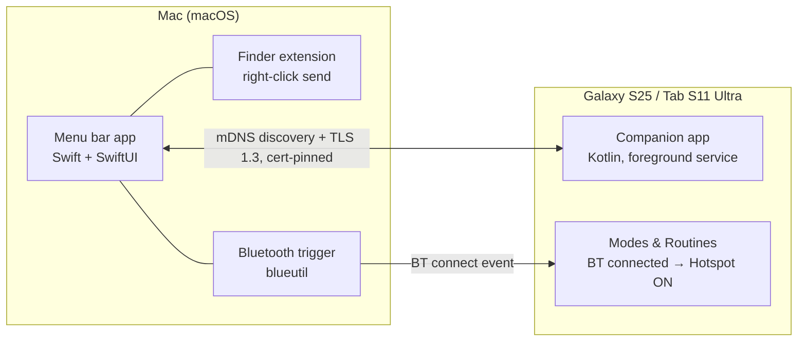

# Mac–Galaxy Bridge

> The Apple Continuity experience for a Mac + Galaxy setup — zero-tap file transfer and a one-click Instant Hotspot, without the walled garden.

[한국어 README](README.ko.md)

## Why

Owning a Mac and a Galaxy phone/tablet means living without Continuity:

- **File transfer**: AirDrop interop now works on recent Galaxy/Pixel devices, but receiving on the phone still requires flipping visibility to *"Everyone"* and tapping *Accept* — every single time. Third-party apps need to be opened on both ends.
- **Hotspot**: Apple's Instant Hotspot (Mac remotely turns on the iPhone's hotspot, no password) has no Android equivalent. You pull out the phone, dig through settings, toggle the hotspot, then wait.

This project closes both gaps for **my own three devices**: MacBook, Galaxy S25, Galaxy Tab S11 Ultra.

## What it does

| Feature | UX |
|---|---|
| **Zero-tap file transfer** | Phone/tablet → Mac: share sheet → "My Mac" → done (auto-saved to `~/Downloads`). Mac → phone/tablet: Finder right-click → "Send to S25" → done. No visibility toggles, no Accept taps. |
| **One-click hotspot** | Click "Connect" in the Mac menu bar → phone turns its hotspot on by itself → Mac auto-joins. Phone stays in your pocket. |
| **Tablet support** | Same companion app runs on the Tab S11 Ultra. |

## How it works

The accept-tap friction is baked into Quick Share / AirDrop's trust model for *unknown* senders — it cannot be removed while using their protocol. So paired devices speak their own protocol instead: mDNS discovery, one-time QR pairing, TLS with certificate pinning, unconditional auto-accept between paired devices (the KDE Connect trust model, purpose-built for this device trio).

The hotspot leg needs no privileged API on the phone: the Mac triggers a Bluetooth connection, and a Samsung **Modes & Routines** rule ("when Mac connects via Bluetooth → turn on Mobile Hotspot") does the toggling with system-level rights.



## How it's different

|  | **Mac–Galaxy Bridge** | [NearDrop](https://github.com/grishka/NearDrop) / [CrossDrop](https://github.com/Medformatik/CrossDrop) / [RQuickShare](https://github.com/Martichou/rquickshare) | [KDE Connect](https://github.com/KDE/kdeconnect-kde) / Soduto | Native AirDrop interop |
|---|---|---|---|---|
| Zero-tap receive on phone | ✅ paired-trust | ❌ accept tap | ✅ | ❌ visibility + accept |
| One-click hotspot from Mac | ✅ | ❌ | ❌ | ❌ |
| Finder right-click send | ✅ | ❌ | ❌ | ❌ |
| Maintained macOS app | ✅ (this) | ✅ | ⚠️ stale / nightly | ✅ |
| No app on the phone | ❌ companion app | ✅ | ❌ | ✅ |

The trade-off is explicit: one set-and-forget companion app on the phone buys zero-tap UX everywhere else.

## Roadmap

- [x] **M1 — One-click hotspot (validation)**: on-device testing showed the two no-code paths (shell `startTethering`, Samsung Routine BT trigger) are both blocked on Android 16 — see [findings](docs/M1_HOTSPOT_FINDINGS.md). Hotspot folds into the companion app: catch `ACL_CONNECTED` directly + accessibility-toggle the tile.
- [ ] **M2 — Transfer core + hotspot toggle**: companion app (mDNS + QR pairing + TLS pinning, auto-accept receive) + `ACL_CONNECTED` listener → AccessibilityService hotspot toggle
- [ ] **M3 — OS integration**: Finder extension, Android share sheet target, tablet rollout
- [ ] **M4 — Extras**: clipboard push (Mac → phone), transfer history

## Repo layout

```
macos/    Swift menu bar app + Finder extension   (M2+)
android/  Kotlin companion app                    (M2+)
scripts/  M1 hotspot scripts
docs/     protocol notes
```

## Stack

Swift 6 / SwiftUI, Network.framework (Bonjour + TLS) · Kotlin, NSD, foreground service · blueutil, Samsung Modes & Routines

## Status

Pre-M1 — project charter and hotspot validation. Built for a personal 3-device setup first; generalization later, maybe.

## License

[MIT](LICENSE)
